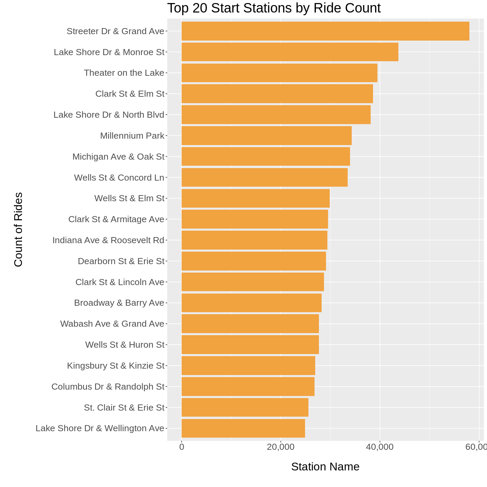
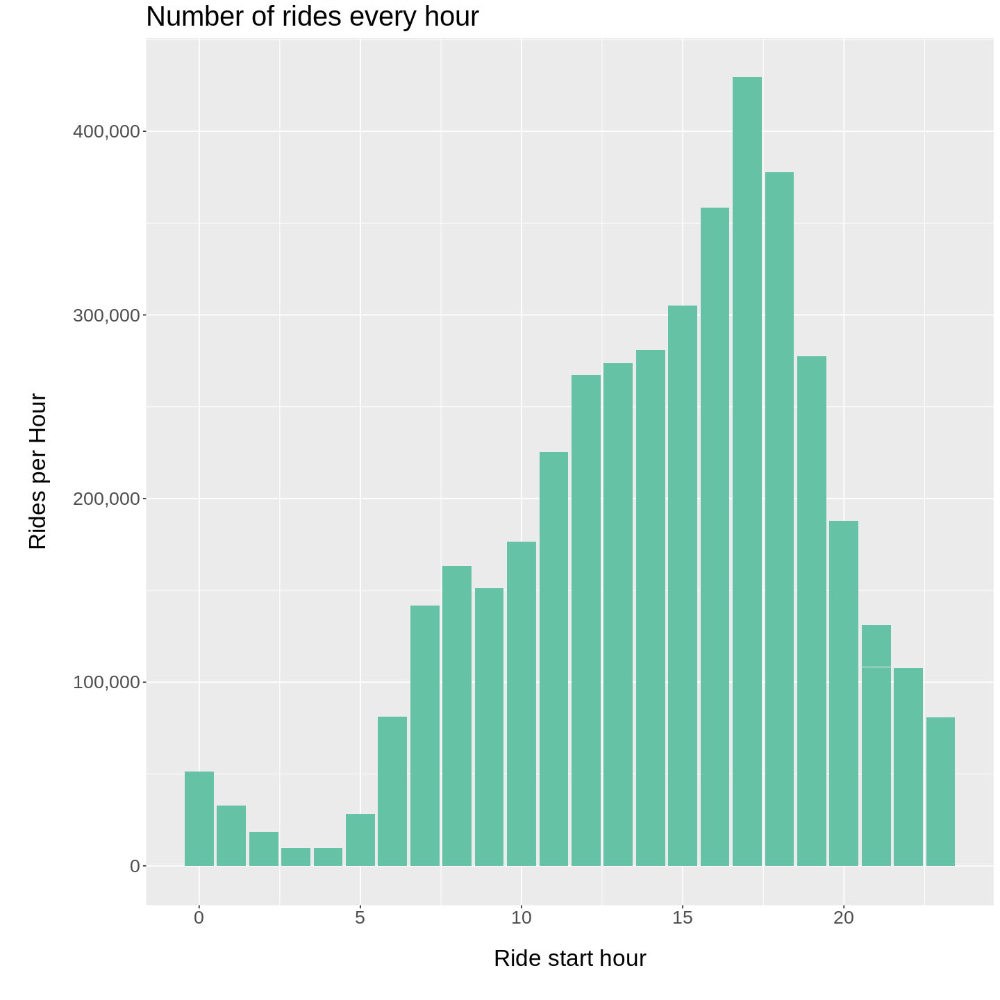
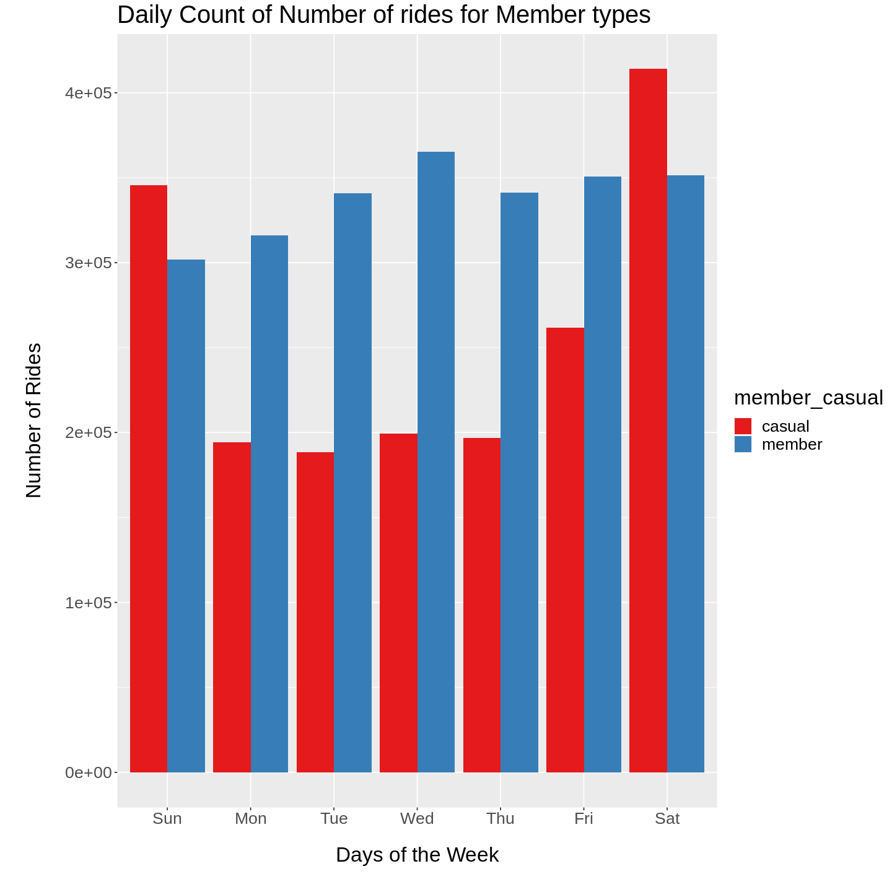
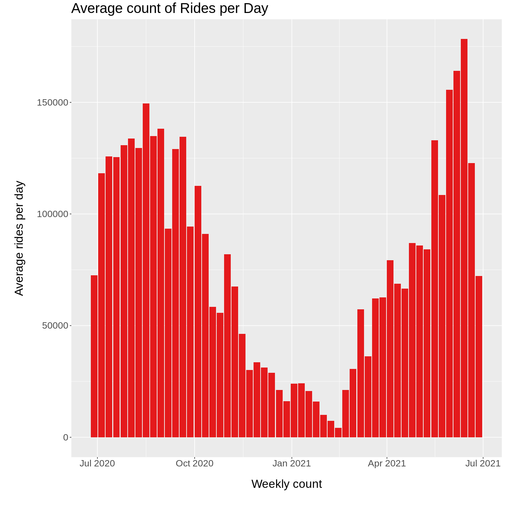

# Cyclistic Bike Share: A Case Study

## Project Overview

A fictional company, **Cyclistic**, Cyclistic launched a successful bike-share offering. The bikes can be unlocked from one station and
returned to any other station in the system anytime.

Cyclistic’s marketing strategy relied on the flexibility of its pricing plans: single-ride passes, full-day passes,and annual memberships. Customers who purchase single-ride or full-day passes are referred to as casual riders. Customers who purchase annual memberships are Cyclistic members.

It has been hypothesized that maximizing the number of annual members, versus casual riders, is the key to their future growth. In order to build a new marketing strategy aimed to convert casual riders into Cyclistic members, the questions that would guide to design marketing strategies for the future marketing program are:

1. How do annual members and casual riders use Cyclistic bikes differently?
2. Why would causal riders buy Cyclistic annual memberships?
3. How can Cyclistic use digital media to influence casual riders to become members?

I will be answering the first question using the 6 steps of data analysis taught in the Google Data Analytics course; ask, prepare, process, analyze, share, and act.

Tools Used : **R programming language** for analysis

## Ask

The director of marketing, is concerned with ensuring this growth by creating a marketing strategy designed to convert casual riders of Cyclistic into annual members. The marketing analytics team, which I am a member of, are concered with using our data to answer the three above questions, and use the answers to guide the marketing program.

The Business Task is to analyze rider's usage patterns for marketing membership conversion programs.

## Prepare

The data used in the project comes is stored in AWS (Amazon Web services). I am using only the past 12 months of trip data, beginning in 2020-06 and ending in 2021-05.
The data is collected directly from Cyclistic and has been made available by Motivate Internation Inc. under this [license](https://www.divvybikes.com/data-license-agreement). The data has been anonymized and no personally identifiable information has been included in the data. While this will prevent analysis which would examine specific personal traits of individual riders, such as individual history or areas of residence, there is still enough data to identify certain behaviours.

## Process (Data Cleaning)

I made the following changes:

* Removed duplicate rows
* Removed rows with null values concerning start and end stations
* Excluded rows reporting electric bike testing
* Excluded geographical coordinates
* Ensured consistency in datatypes across variables
* Created a column to report duration of each ride
* Created a column to show the day of the week for each ride
* Created columns for month and year of the ride
* Excluded trips lasting less than 1 minute, or over 24 hours

## Analyze
After cleeaning the data, I carried out analysis by exploring relationships between several variables
- Created a summary for weekly usage of bikes
- Different types of bike and it's usage
- Weekly distribution of different types of bike used
- Number of bikes used on hourly basis
- Number of bikes used on each week day basis
- Average duration of bike ride on weekly basis
- Type of member usgae on weekly basis
- Type of member usgae on monthly basis
- Top 20 stations based on ride start station name
- Minutes of a ride by Bike Type and Week
- Average trip minutes on weekly basis

Some of the graphs for the analysis:

 
 

 

## Share
Link to [Tableau](wwww.google.com)

## Act 
### Key Findings
1. From the week day analysis of data, we can see that the number of casual members shoot up in the weekends.
2. From the weekly count of average rides, we can see that the average number of rides in summer(June, July, August, stretching to September end) are more than rest of the year.
3. From the hourly analysis for number of rides, we can observe that the number of rides in the evening hours is the peakusage hours of our service.
4. From the weekly analysis of types of bikes used, lately the use of classic bikes have shoot up compared to docked and electric bikes.

### Recommendations
1. Advertise how a membership can save money for those customers who take longer rides.
2. Target casual customers who rent a bike for leisure on their weekends.
3. Introduce referral system where existing members can refer their friends to buy membership in discounted prices preferrably on weekends.
4. Create a large summer campaign when more people are likely to rent a bike.
